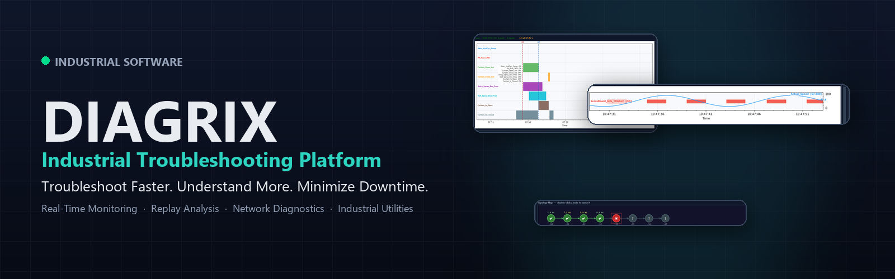
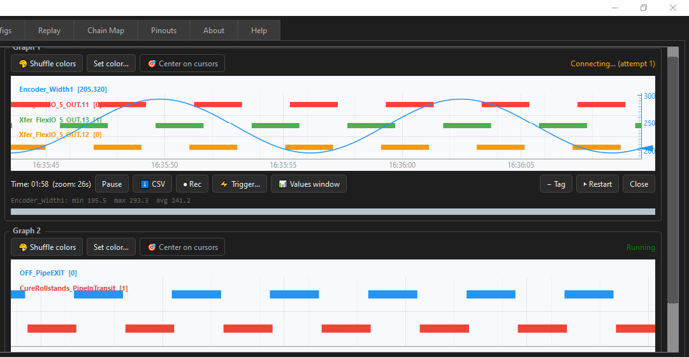
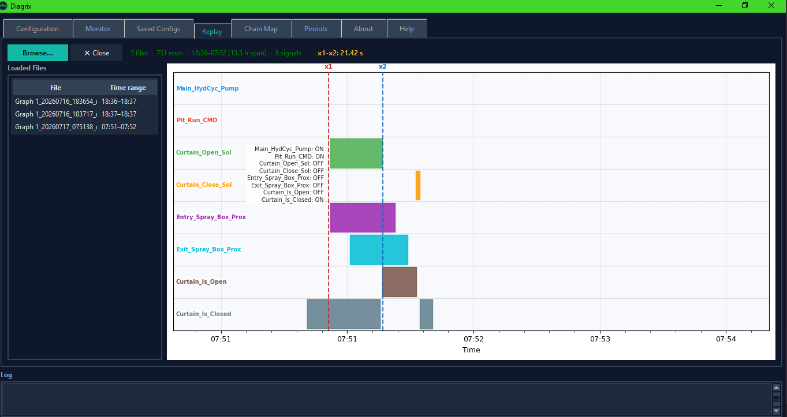
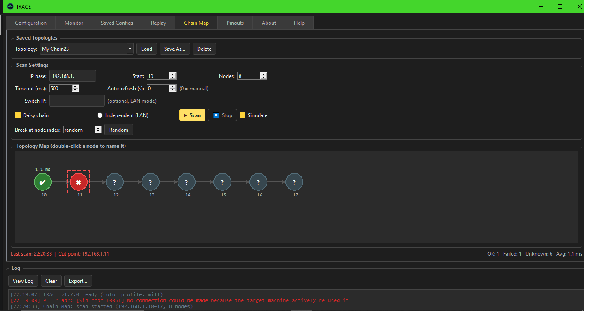
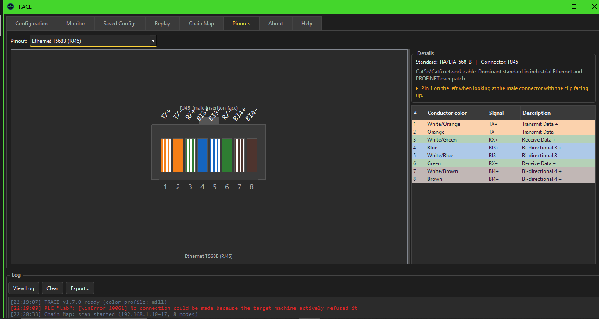

  

# Diagrix

**An industrial troubleshooting and diagnostics platform for PLC-connected equipment.**

Diagrix gives maintenance technicians, automation engineers, and controls engineers a fast,
direct view into what a PLC-connected machine is doing, in real time and after the fact, without
an expensive proprietary toolchain.

[**Visit diagrix.us →**](https://diagrix.us)

---

## What Diagrix Does

Industrial troubleshooting usually means one of two things: staring at a control panel hoping
to catch a fault as it happens, or digging through vendor-specific tools that are expensive,
locked to a single hardware ecosystem, or too generic to answer field questions quickly.

Diagrix is built around a simpler idea: give the people closest to the machine (technicians,
electricians, and engineers) a direct, real-time and historical view of signal behavior, plus the
network and connector context needed to find a problem fast.

## Feature Highlights

- **Real-time monitoring** of PLC signals with multiple synchronized graphs
- **Digital and analog** signal visualization, side by side
- **Session replay** with time cursors for post-incident analysis
- **Network topology mapping** for industrial Ethernet daisy chains
- **Connector pinout reference library** for common industrial standards
- **CSV export and recording** for reporting and further analysis
- Installs and runs as a local desktop application, with no cloud dependency

## Screenshots

### Live Monitoring

Multiple signals, digital and analog, tracked live and side by side, so a fault is visible the
moment it happens instead of being pieced together afterward.

### Replay

Load a recorded session and step through it with dual time cursors to measure exactly how long
each event took and how signals relate to one another.

### Chain Map

A live map of an industrial Ethernet daisy chain, showing per-node latency and pinpointing
exactly where a network segment has failed.

### Pinouts

An offline reference for industrial connector standards, covering pin numbering, signal
assignment, and color coding, without leaving the application.

See [`docs/screenshots.md`](docs/screenshots.md) for the full gallery with extended
descriptions.

## Main Modules

| Module | Description | Learn more |
|---|---|---|
| **Live Monitoring** | Real-time graphing of digital and analog PLC signals | [docs/monitor.md](docs/monitor.md) |
| **Replay** | Historical playback and event analysis of recorded sessions | [docs/replay.md](docs/replay.md) |
| **Chain Map** | Industrial Ethernet topology and fault localization | [docs/chain-map.md](docs/chain-map.md) |
| **Pinout Library** | Reference for industrial connector standards | [docs/pinouts.md](docs/pinouts.md) |

## Why Diagrix

- **Built for the field, not the lab.** Fast to open and fast to point at a PLC, with no project
  files or engineering workstation to set up first.
- **One tool, four jobs.** Live monitoring, historical replay, network diagnostics, and a
  connector reference live in a single application instead of four separate ones.
- **Works without a live PLC.** A built-in simulation mode makes it possible to learn the tool,
  prepare a layout, or run a demo entirely offline.
- **Your data stays yours.** Diagrix runs locally and does not transmit signal data, tags, or
  project information anywhere.

## Technology Overview

Diagrix is a lightweight desktop application for Windows. It connects to PLC-connected equipment
over standard industrial Ethernet, runs entirely on the local machine, and stores its
configuration and recordings locally. There's no server component, no account requirement, and no
telemetry. This repository documents the product; the application itself is closed-source
commercial software.

## Roadmap

Diagrix is under active development. Here's the short version of where it's headed; the full
breakdown is in [`ROADMAP.md`](ROADMAP.md):

- **0.9 — Core Platform:** live monitoring, replay, CSV export, chain map, pinout library
- **1.0 — Professional Release:** licensing, settings sync, refined UI, installer, automatic updates
- **1.5 — Operations:** alarm manager, report generator, PDF reports, project & machine profiles
- **2.0 — Intelligence:** AI assistant, failure analysis, maintenance suggestions, root cause analysis

## Current Development Status

Diagrix's core modules (Live Monitoring, Replay, Chain Map, and the Pinout Library) are
functional and in daily use. The project is progressing toward its 1.0 professional release.
Follow progress and get in touch through the channels below.

## FAQ

**What PLCs are supported?**
Allen-Bradley controllers over EtherNet/IP. Support for additional protocols is being evaluated
for future releases.

**Is an internet connection required?**
No. Diagrix runs entirely on the local network segment where the PLC lives.

**Can recorded sessions be replayed later?**
Yes. The Replay module is built specifically for loading and analyzing past recording sessions.

**Can I export data?**
Yes, recordings can be exported to CSV for reporting or further analysis in other tools.

**Is Diagrix open source?**
No. Diagrix is closed-source commercial software. This repository documents the product
publicly; the source code is not published.

See the [full FAQ](docs/faq.md) for more.

## Contact

- Website: [diagrix.us](https://diagrix.us)
- Email: [info@diagrix.us](mailto:info@diagrix.us)

## License

This repository (documentation and media) is provided for informational purposes only. See
[`LICENSE.md`](LICENSE.md). It does not grant any license to the Diagrix software itself; visit
[diagrix.us](https://diagrix.us) for product licensing information.
