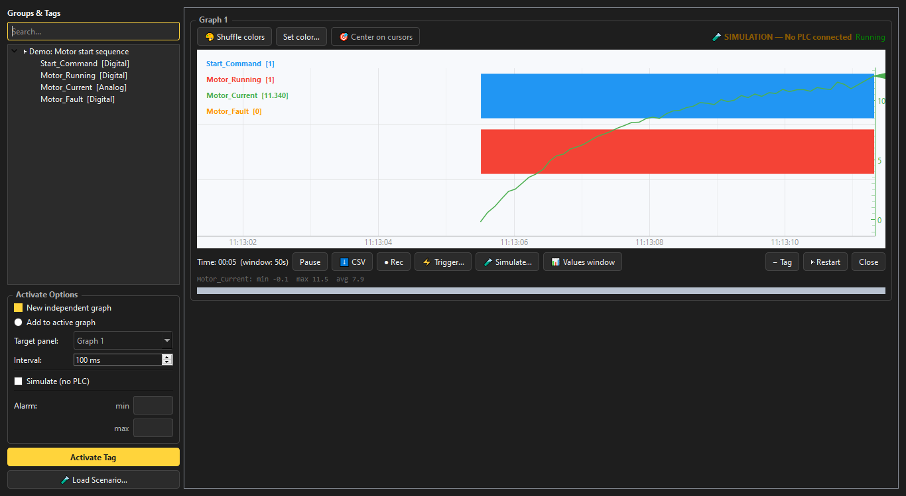

# Simulation Mode

Practice troubleshooting, prepare a layout, or demonstrate the tool, without a physical PLC.

## What it does

Every tag activated with **Simulate (no PLC)** ticked is driven by a configurable signal pattern
instead of a real PLC read. A tag with no pattern configured falls back to a simple default (an
alternating on/off for Digital, a sine wave for Analog).

## Capabilities

- **13 configurable signal patterns**: 6 Digital (Constant, Periodic pulse, Single pulse, Contact
  bounce, Intermittent dropout, Delayed follower) and 7 Analog (Constant, Sine, Triangle,
  Sawtooth, Step, First-order response, Random walk), each with its own parameters
- **Optional Gaussian noise** on Analog patterns, with its own output limits kept separate from
  the pattern's own range, so noise can't accidentally hide or force an alarm crossing
- **Ready-made scenarios**: Basic signal demo, Motor start sequence, Intermittent sensor problem,
  and Analog alarm demonstration, each opening its own panel automatically in one click
- **Manual events**: force a tag's value, freeze it at its current value, or apply a temporary
  spike or dip to an Analog signal before it returns to its underlying pattern
- **Simulated communication interruption**: stop and resume publishing updates for a panel; the
  interruption appears as a real gap with a warning, never as zeros or repeated values
- Works alongside every other module: recording, conditional triggers, CSV export, and Replay all
  work the same way on simulated data as on real PLC data

## Why it matters

Not every troubleshooting skill needs a live fault to practice on. Simulation Mode lets a student,
new hire, or instructor build a realistic signal scenario, including messy ones like a bouncing
contact or an intermittent dropout, and work through diagnosing it with the exact same tools used
on a real machine.

---

[← Pinout Library](pinouts.md) · [Back to Overview](overview.md)
